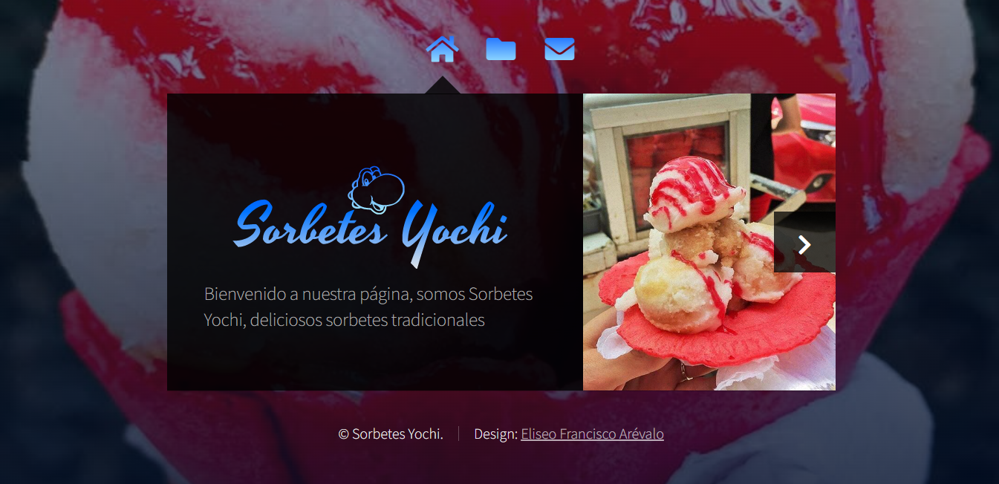
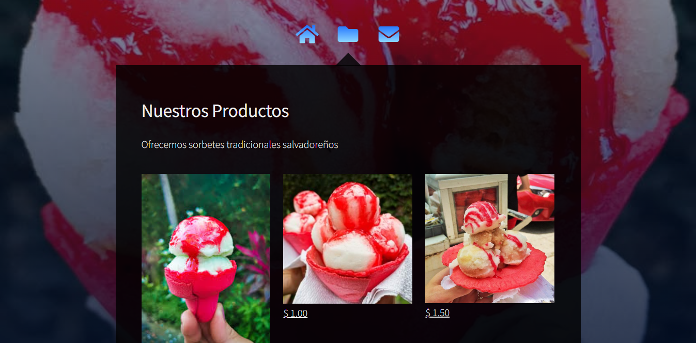
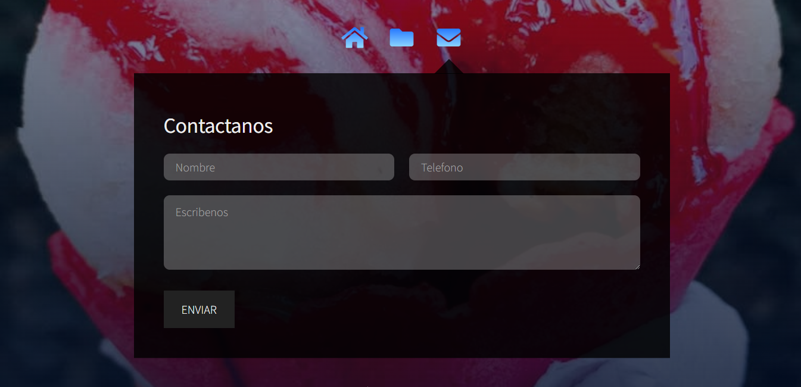

# SORBETES YOCHI

Pequeño negocio en la localidad de Izalco, que vende helados tradicionales, el cual necesitaba una página para vender su producto

## Landing page - Sorbetes Yochi

---

Personalización de este sitio contruido con:

- HTML
  - ningun procesador
- CSS (SASS)
  - funciona con modulos \_scss
- JS (Jquery)
  - vanilla y Jquery 3.6

En el cual se incluyo el modify.css invocado en el `<head>` despues de los demas estilos para modificar y estructuras mejor el contenido

### Nuestros productos

---

Sección en la que se muestran los productos y al dar click en el precio de cada uno abre el formulario de contacto

### Contactanos

---

Funciona con [Formsubmit.co]("https://formsubmit.co/") el cual simula el sistema cliente/servidor para enviar el mensaje del usuario a un correo, en este caso a [sorbetes.yochi@gmail.com]("sorbetes.yochi@gmail.com")

